# Azure Model-as-a-Service Model Adapters

This repository contains the code for Dataloop model adapters that invoke models served in Azure via their API ANS
Endpoint.
To use this model adapter, it is needed to have a workspace in Azure and a model serving endpoint in the workspace.

More information on Azure ML can be found [here](https://azure.microsoft.com/en-us/products/machine-learning).

## Deploy Azure Model

Generating API Key and Endpoint

### 1. Login to your account

First, log into your Azure account and Navigate to Azure Machine Learning Service.

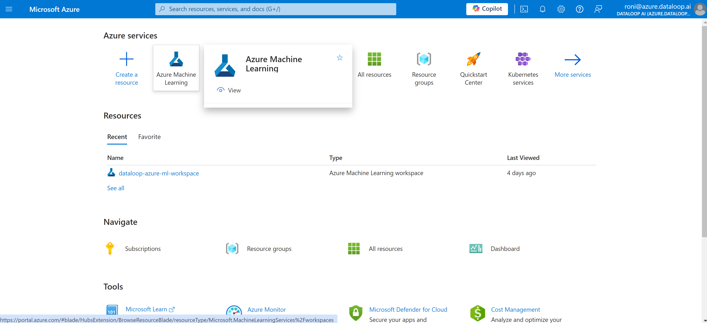

### 2. Workspace

Navigate to your Azure ML workspace. If you don't already have a workspace, create a new one.

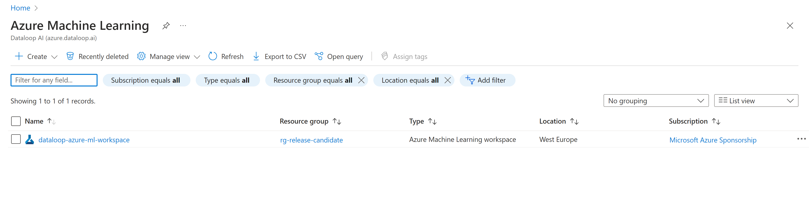

### 3. Launch Azure ML Studio

Enter your workspace and Launch the Azure ML Studio from the portal.

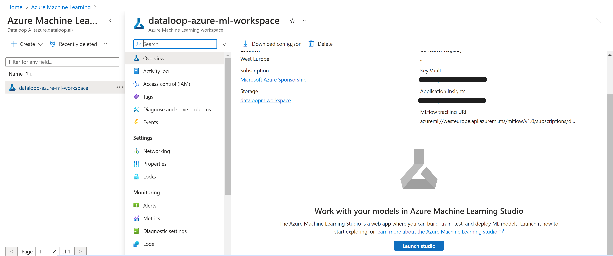

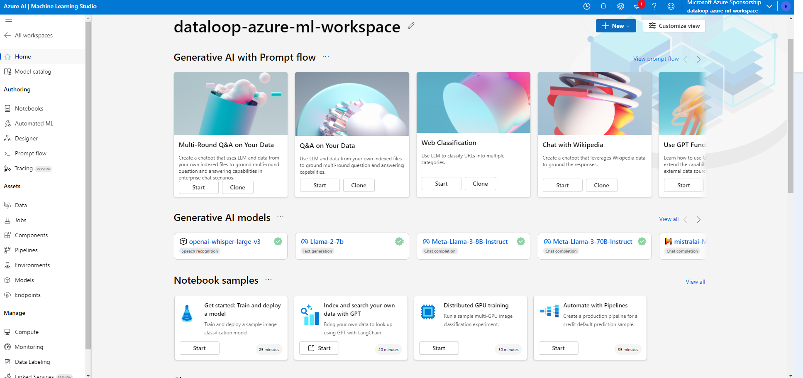

### 4. Filter Serverless API

In Azure ML Studio, filter to show only serverless API options.

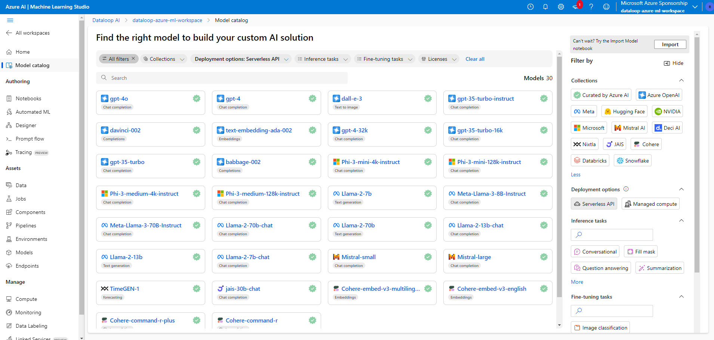

### 5. Deploy a Model

Deploy your model, choose serverless API option.

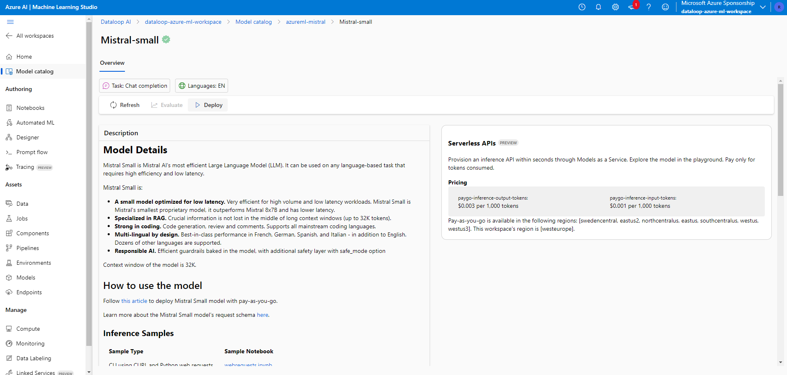
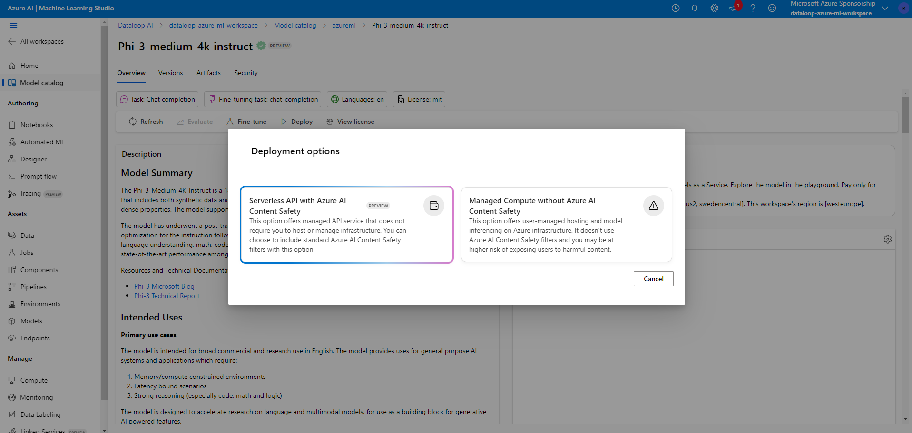

### 6. Get an API Key and Endpoint URL

After deploying the model, retrieve the API key and Endpoint URL for accessing your model.

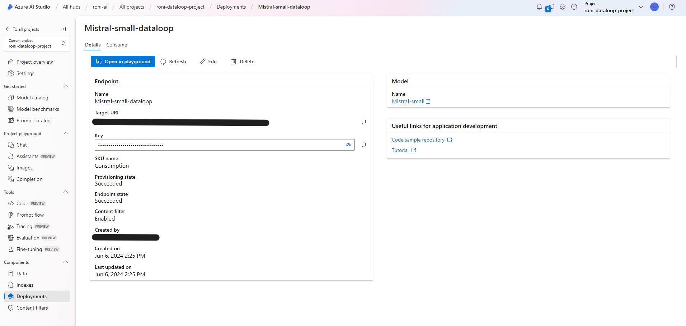

---

By following these steps, you should be able to deploy your model using Azure ML and make use of serverless
capabilities.
If you encounter any issues, refer to the Azure ML documentation.

## Dataloop Platform

Once you have an API key and a Url you can access and get a response from your model in Dataloop platform.

### 1. Install the model from Dataloop Marketplace

Go to Marketplace, Models tab, and search for the requested model (Azure and Model's name) and install:

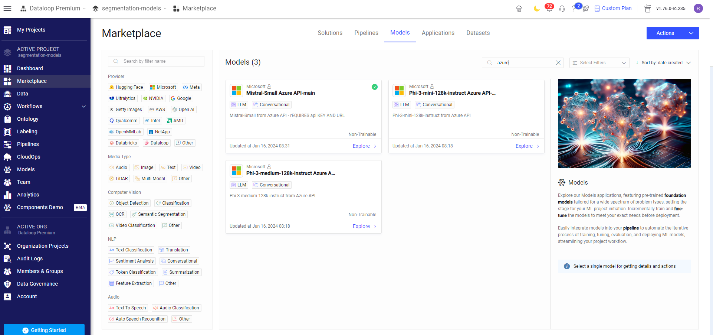
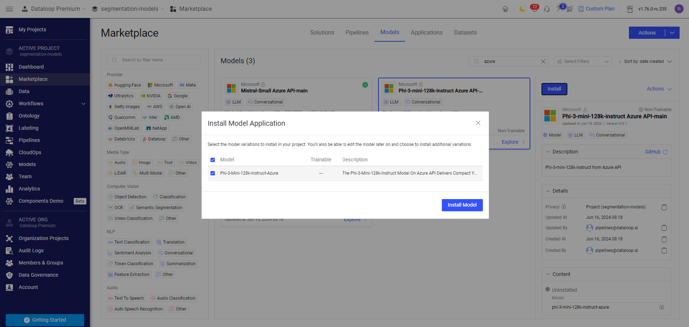

### 2. Edit the Endpoint-url in the model's configuration

#### 2.1 On model's configuration edit `endpoint-url` with your url:

Navigate to Model management tab, and click on the installed model:

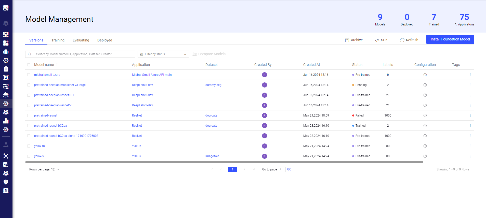

Insert your url in `endpoint-url` and click `Save`.

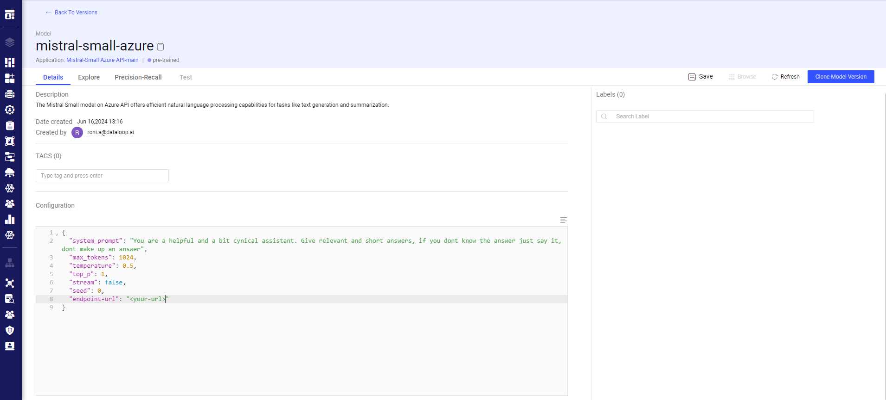

#### 2.2 On Data Governance tab, add your API key:

1. Click on create integration and choose `create secret`

   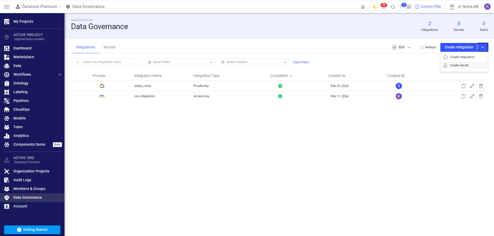

2. Choose a `secret name` an insert your API key.

   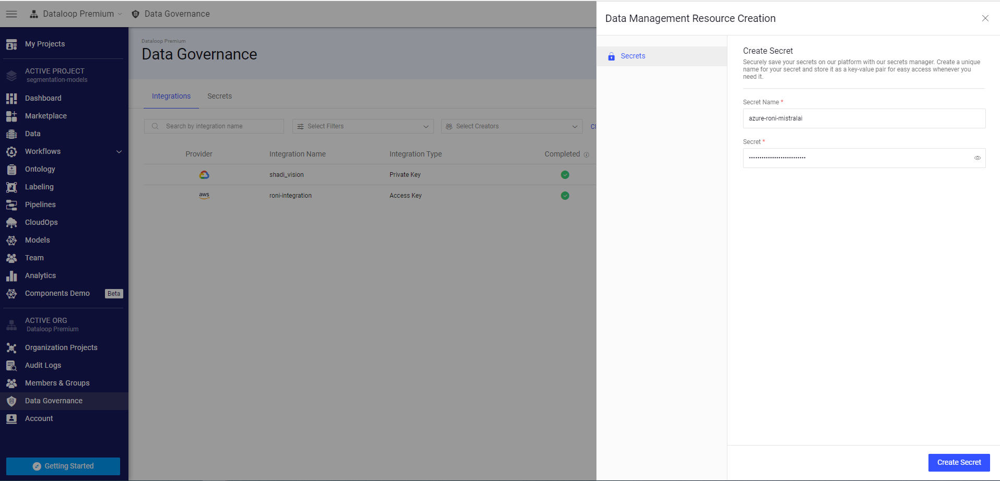

### 3. Add secret name to the service
* In your pipeline, click on the Model node and choose `edit service configuration`

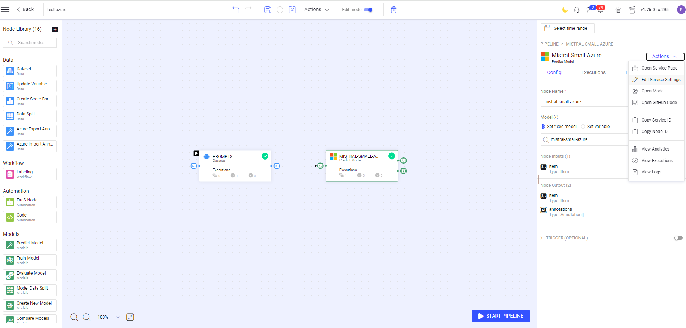

* In `init inputs value`, edit `azure-api-key-name` and insert your secret name. In `Secrets & Integrations` insert 
your secret by choosing from the options list.

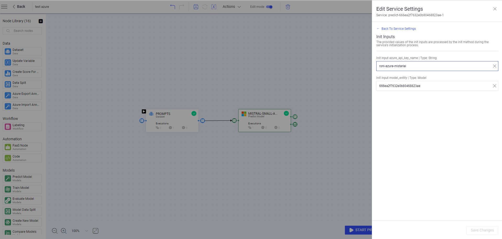

After following these steps, you be able to use Azure Serverless API models via Dataloop Platform.